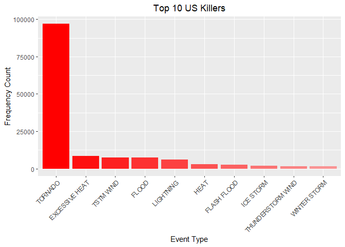

##global options

```r
knitr::opts_chunk$set( fig.path='figure/', echo = TRUE, cache = TRUE )
```

## Introduction

Storms and other severe weather events can cause both public health and economic problems for communities and municipalities. Many severe events can result in fatalities, injuries, and property damage, and preventing such outcomes to the extent possible is a key concern.

This project involves exploring the U.S. National Oceanic and Atmospheric Administration's (NOAA) storm database. This database tracks characteristics of major storms and weather events in the United States, including when and where they occur, as well as estimates of any fatalities, injuries, and property damage.

## Synopsis
The goal of the assignment is to explore the NOAA Storm Database and explore the effects of severe weather events on both population and economy.The database covers the time period between 1950 and November 2011.

The following analysis investigates which types of severe weather events are most harmful on:

1. Health (injuries and fatalities) 
2. Property and crops (economic consequences)

Information on the Data: [Documentation](https://d396qusza40orc.cloudfront.net/repdata%2Fpeer2_doc%2Fpd01016005curr.pdf)

## Data Processing

### Loading Data
Download the file and extract the data into a dataframe

```r
library("data.table")
library("ggplot2")

fileUrl <- "https://d396qusza40orc.cloudfront.net/repdata%2Fdata%2FStormData.csv.bz2"
destinationFiile = "repdata%2Fdata%2FStormData.csv.bz2"
download.file(fileUrl, destfile = destinationFiile)
stormCSV <- read.csv("repdata%2Fdata%2FStormData.csv.bz2")

# Converting dataframe to data.table
stormDataSet <- as.data.table(stormCSV)
```

### Exploring Dataset
Take a look at the column names

```r
colnames(stormDataSet)
```

```
##  [1] "STATE__"    "BGN_DATE"   "BGN_TIME"   "TIME_ZONE"  "COUNTY"    
##  [6] "COUNTYNAME" "STATE"      "EVTYPE"     "BGN_RANGE"  "BGN_AZI"   
## [11] "BGN_LOCATI" "END_DATE"   "END_TIME"   "COUNTY_END" "COUNTYENDN"
## [16] "END_RANGE"  "END_AZI"    "END_LOCATI" "LENGTH"     "WIDTH"     
## [21] "F"          "MAG"        "FATALITIES" "INJURIES"   "PROPDMG"   
## [26] "PROPDMGEXP" "CROPDMG"    "CROPDMGEXP" "WFO"        "STATEOFFIC"
## [31] "ZONENAMES"  "LATITUDE"   "LONGITUDE"  "LATITUDE_E" "LONGITUDE_"
## [36] "REMARKS"    "REFNUM"
```
### Subsetting
Create a dataset with the columns that we are interested

```r
stormDataSet <- stormDataSet[ ,c("EVTYPE", "FATALITIES", "INJURIES"  , "PROPDMG" ,   "PROPDMGEXP" ,"CROPDMG"    ,"CROPDMGEXP" )]
```
### Clean and filter dataset 
Fix datatypes and filter for where fatalities or injuries >0

```r
stormDataSet <- stormDataSet[EVTYPE != "?"]
stormDataSet$CROPDMGEXP <- as.character(stormDataSet$CROPDMGEXP)
stormDataSet <- stormDataSet[ INJURIES > 0 | FATALITIES > 0 | PROPDMG > 0 | CROPDMG > 0]

cols <- c("PROPDMGEXP", "CROPDMGEXP")
stormDataSet[,  (cols) := c(lapply(.SD, toupper)), .SDcols = cols]

#convert exponents to numbers

propertyDamageKey <-  c("\"\"" = 10^0,
                 "-" = 10^0, 
                 "+" = 10^0,
                 "0" = 10^0,
                 "1" = 10^1,
                 "2" = 10^2,
                 "3" = 10^3,
                 "4" = 10^4,
                 "5" = 10^5,
                 "6" = 10^6,
                 "7" = 10^7,
                 "8" = 10^8,
                 "9" = 10^9,
                 "H" = 10^2,
                 "K" = 10^3,
                 "M" = 10^6,
                 "B" = 10^9)


cropDamageKey <-  c("\"\"" = 10^0,
                "?" = 10^0, 
                "0" = 10^0,
                "K" = 10^3,
                "M" = 10^6,
                "B" = 10^9)

stormDataSet[, PROPDMGEXP := propertyDamageKey[as.character(stormDataSet[,PROPDMGEXP])]]
stormDataSet[is.na(PROPDMGEXP), PROPDMGEXP := 10^0 ]

stormDataSet[, CROPDMGEXP := cropDamageKey[as.character(stormDataSet[,CROPDMGEXP])] ]
stormDataSet[is.na(CROPDMGEXP), CROPDMGEXP := 10^0 ]

head(stormDataSet)
```

```
##     EVTYPE FATALITIES INJURIES PROPDMG PROPDMGEXP CROPDMG CROPDMGEXP
## 1: TORNADO          0       15    25.0       1000       0          1
## 2: TORNADO          0        0     2.5       1000       0          1
## 3: TORNADO          0        2    25.0       1000       0          1
## 4: TORNADO          0        2     2.5       1000       0          1
## 5: TORNADO          0        2     2.5       1000       0          1
## 6: TORNADO          0        6     2.5       1000       0          1
```
### Calculation costs for crop and property

```r
stormDataSet$ECONOMIC_LOSS <- (stormDataSet$CROPDMG*stormDataSet$CROPDMGEXP +     stormDataSet$PROPDMG*stormDataSet$PROPDMGEXP)

stormDataSet$HEALTH_LOSS <- stormDataSet$FATALITIES + stormDataSet$INJURIES
head(stormDataSet)
```

```
##     EVTYPE FATALITIES INJURIES PROPDMG PROPDMGEXP CROPDMG CROPDMGEXP
## 1: TORNADO          0       15    25.0       1000       0          1
## 2: TORNADO          0        0     2.5       1000       0          1
## 3: TORNADO          0        2    25.0       1000       0          1
## 4: TORNADO          0        2     2.5       1000       0          1
## 5: TORNADO          0        2     2.5       1000       0          1
## 6: TORNADO          0        6     2.5       1000       0          1
##    ECONOMIC_LOSS HEALTH_LOSS
## 1:         25000          15
## 2:          2500           0
## 3:         25000           2
## 4:          2500           2
## 5:          2500           2
## 6:          2500           6
```

## Events that are Most Harmful to Population Health 
### Summarize data for health impact


```r
SummaryHealthLoss <- aggregate(HEALTH_LOSS~EVTYPE, stormDataSet, sum)
SummaryHealthLoss <- SummaryHealthLoss[ order( SummaryHealthLoss$HEALTH_LOSS, decreasing = T),]
head(SummaryHealthLoss, 10)
```

```
##                EVTYPE HEALTH_LOSS
## 406           TORNADO       96979
## 60     EXCESSIVE HEAT        8428
## 422         TSTM WIND        7461
## 85              FLOOD        7259
## 257         LIGHTNING        6046
## 150              HEAT        3037
## 72        FLASH FLOOD        2755
## 237         ICE STORM        2064
## 363 THUNDERSTORM WIND        1621
## 480      WINTER STORM        1527
```

## Results


```r
pal <- colorRampPalette(c("red", "#f99494"))
topN <- 10
healthBarChart <- ggplot(SummaryHealthLoss[1:topN,], aes(x=reorder(EVTYPE, -HEALTH_LOSS), y=HEALTH_LOSS))
healthBarChart = healthBarChart + geom_bar(stat="identity", fill=pal(topN), position="dodge")
# y axis
healthBarChart = healthBarChart + ylab("Frequency Count") 
# x-axis 
healthBarChart = healthBarChart + xlab("Event Type") 

healthBarChart = healthBarChart + theme(axis.text.x = element_text(angle=45, hjust=1))
healthBarChart = healthBarChart + ggtitle("Top 10 US Killers") + theme(plot.title = element_text(hjust = 0.5))

print(healthBarChart)
```

<!-- -->

## Events that have the Greatest Economic Impact 
### Summarize data for economic impact

```r
SummaryEconomicLoss <- aggregate(ECONOMIC_LOSS~EVTYPE, stormDataSet, sum)
SummaryEconomicLoss <- SummaryEconomicLoss[ order( SummaryEconomicLoss$ECONOMIC_LOSS, decreasing = T),]
head(SummaryEconomicLoss, 10)
```

```
##                EVTYPE ECONOMIC_LOSS
## 85              FLOOD  150319678257
## 223 HURRICANE/TYPHOON   71913712800
## 406           TORNADO   57362333947
## 349       STORM SURGE   43323541000
## 133              HAIL   18761221986
## 72        FLASH FLOOD   18243991079
## 48            DROUGHT   15018672000
## 214         HURRICANE   14610229010
## 309       RIVER FLOOD   10148404500
## 237         ICE STORM    8967041360
```

## Results

```r
pal <- colorRampPalette(c("red", "#f99494"))
topN <- 10


EconomicBarChart <- ggplot(SummaryEconomicLoss[1:topN,], aes(x=reorder(EVTYPE, -ECONOMIC_LOSS), y=ECONOMIC_LOSS))
EconomicBarChart = EconomicBarChart + geom_bar(stat="identity", fill=pal(topN), position="dodge")
# y axis
EconomicBarChart = EconomicBarChart + ylab("Frequency Count") 
# x-axis 
EconomicBarChart = EconomicBarChart + xlab("Event Type") 

EconomicBarChart = EconomicBarChart + theme(axis.text.x = element_text(angle=45, hjust=1))
EconomicBarChart = EconomicBarChart + ggtitle("Top 10 US Events with Economic impact") + theme(plot.title = element_text(hjust = 0.5))

print(EconomicBarChart)
```

<!-- -->
